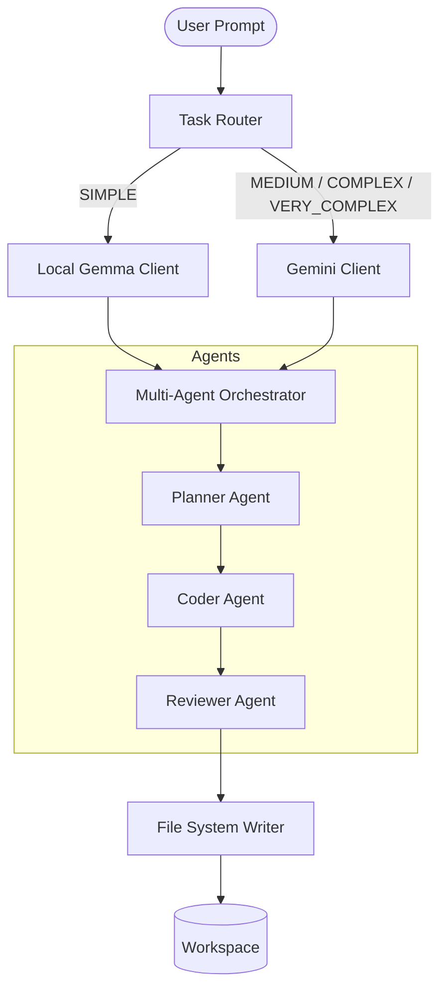

# Multi-Agent Coding Assistant (MACA)

MACA is a **local-first, hybrid AI coding assistant** that routes work by complexity and coordinates planning, coding, and review agents directly in your workspace.

> **Why it matters:** simple tasks stay on your machine, while more demanding work can use powerful cloud models only when they are truly needed.

## ✨ What Makes MACA Different

- **Local-first by design:** keep routine work private, fast, and free from token billing.
- **Hybrid routing:** use local models for simple tasks and stronger cloud models for harder reasoning.
- **Agentic workflow:** planner, coder, and reviewer agents collaborate to improve the final result.

## 🚀 Core Features

- **Smart task routing:** analyzes each request and sends it to the best backend for the job.
  - **Simple tasks:** local Gemma (`gemma2:2b`) via Ollama.
  - **Medium / complex / very complex tasks:** Google Gemini (`gemini-3.5-flash`) via REST API when a key is configured.
- **Multi-agent orchestration:** coordinates a planner, coder, and reviewer to work through tasks in sequence.
  - **Planner Agent:** inspects the codebase and creates an implementation plan.
  - **Coder Agent:** writes and applies the actual code changes.
  - **Reviewer Agent:** checks for logic, syntax, and safety issues before final approval.
- **Auto-apply workflow:** updates your files directly in the current workspace.
- **Robust fallbacks:** handles blocked Ollama ports, offline/mock mode, and terminal output fallback paths without breaking the experience.

---

## 🏗️ Architecture



---

## 🛠️ Setup Instructions

### 1. Install and run the CLI
Use the local launcher scripts under [local/scripts](local/scripts):
```sh
./local/scripts/install_mac.sh
./local/scripts/run_mac.sh
```

If you only need the Gemma/Ollama setup, use:
```sh
./local/scripts/setup_gemma.sh
```

### 2. Configure API Keys (Environment or macOS Keychain)
MACA currently uses Gemini for medium and above tasks. For secure setup details, see [docs/keys_setup.md](docs/keys_setup.md).

* **Quick Env Setup**:
  ```bash
  export GEMINI_API_KEY="your-gemini-api-key"
  ```
* **Recommended macOS Keychain + .zshenv Setup**:
  ```bash
  security add-generic-password -a "$USER" -s "MACA_GEMINI_API_KEY" -w "your-gemini-key"
  echo 'export GEMINI_API_KEY="$(security find-generic-password -a "$USER" -s "MACA_GEMINI_API_KEY" -w 2>/dev/null)"' >> ~/.zshenv
  source ~/.zshenv
  ```
  This keeps the secret in your Keychain and makes it available to MACA every time a new zsh session starts.

### 3. Run tests
```sh
PYTHONPATH=src python -m unittest discover -s tests -v
```

---

## 💻 How to Use

### Run in Interactive REPL Mode
Launch the interactive console:
```sh
python3 -B src/maca/main.py
```

### Run a Single Command Task
Submit a task directly from your terminal:
```sh
maca "write a simple hello world script in output.py"
```

### Force a Specific Model
Override default task routing:
```sh
maca --model gemini "implement a custom tokenizer"
```

### Run in Mock Mode (Simulated Run)
Test the orchestrator workflow without local models or API keys:
```sh
maca --mock "create an event logging class in python"
```
