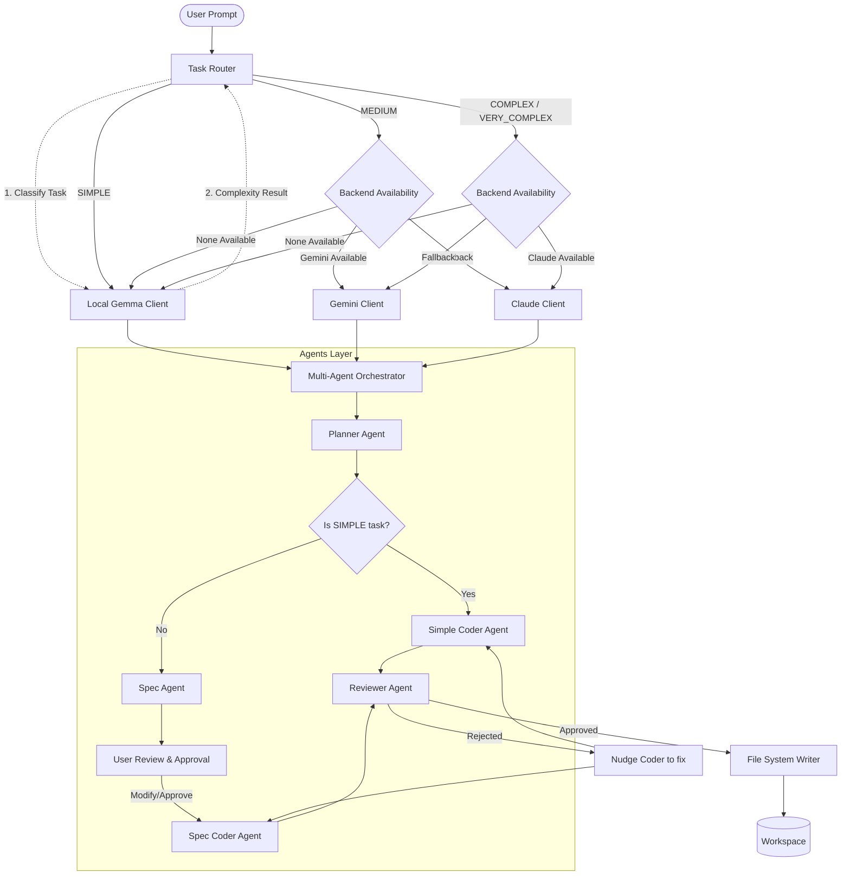

# Multi-Agent Coding Assistant (MACA)

> [!WARNING]
> **MACA is currently in active development and is in the ALPHA stage.**
> You may encounter bugs, breaking changes, or unfinished features.

MACA is a **local-first, hybrid AI coding assistant** that routes work by complexity and coordinates planning, coding, and review agents directly in your workspace.

> **Why it matters:** simple tasks stay on your machine, while more demanding work can use powerful cloud models only when they are truly needed.

## ✨ What Makes MACA Different

- **Local-first by design:** keep routine work private, fast, and free from token billing.
- **Hybrid routing:** use local models for simple tasks and stronger cloud models for harder reasoning.
- **Agentic workflow:** planner, coder, and reviewer agents collaborate to improve the final result.

## 🚀 Core Features

- **Smart task routing:** analyzes each request and sends it to the best backend for the job.
  - **Simple tasks:** local Gemma (`gemma2:2b`) via Ollama.
  - **Medium complexity tasks:** Google Gemini (`gemini-3.5-flash`) via REST API. If Gemini is offline/unconfigured, falls back to Anthropic Claude, then local Gemma.
  - **Complex / Very Complex tasks:** Anthropic Claude (default `claude-opus-4-8` or custom model) via Messages API. If Claude is offline/unconfigured, falls back to Google Gemini, then local Gemma.
- **Multi-agent orchestration:** coordinates a planner, coder, and reviewer to work through tasks in sequence.
  - **Planner Agent:** inspects the codebase and creates an implementation plan.
  - **Coder Agent:** writes and applies the actual code changes.
  - **Reviewer Agent:** checks for logic, syntax, and safety issues before final approval.
- **Auto-apply workflow:** updates your files directly in the current workspace.
- **Robust fallbacks:** handles blocked Ollama ports, offline/mock mode, and terminal output fallback paths without breaking the experience.

---

## 🏗️ Architecture



### 1. How Task Routing Works

MACA evaluates task complexity before selecting a model to execute the coding assignment:
- **Complexity Assessment**:
  - The **Task Router** queries the local Gemma model (gemma2:2b via Ollama) to analyze the user prompt and classify it into one of four categories: SIMPLE, MEDIUM, COMPLEX, or VERY_COMPLEX.
  - *Fallback Heuristic*: If Gemma/Ollama is offline, the router falls back to a regex-based keyword density and word count heuristic classifier to make a prediction.
- **Model Assignment & Fallbacks**:
  - **SIMPLE Tasks**: Handled entirely locally by the **Local Gemma Client** to minimize latency and token usage.
  - **MEDIUM Tasks**: Routed preferentially to **Gemini Client** (Flash/Pro) for rapid, intelligent processing. If Gemini is configured but offline, it falls back to **Claude Client** (or local Gemma if no remote APIs are online).
  - **COMPLEX or VERY_COMPLEX Tasks**: Routed preferentially to **Claude Client** (Opus/Sonnet) for advanced reasoning. If Claude is configured but offline, it falls back to **Gemini Client** (or local Gemma if necessary).

---

### 2. How Agents Collaborate

Once a model client has been assigned, the **Multi-Agent Orchestrator** manages the coding pipeline using a suite of dedicated, specialized agents:

1. **Planner Agent**:
   - Analyzes the task description and list of files in the workspace.
   - Generates a structured Markdown implementation plan specifying the files to create or modify.
   - Saves the plan to .maca/plan-<task>.md.

2. **Complexity Routing**:
   - **For SIMPLE Tasks**: Bypasses the specification phase entirely. The orchestrator routes the task directly to the **Simple Coder Agent**, which implements the modifications based solely on the plan.
   - **For MEDIUM/COMPLEX Tasks**: The orchestrator routes the task to the **Spec Agent** first.

3. **Spec Agent (Spec Flow)**:
   - Generates a detailed **Technical Specification** document from the plan.
   - Saves it to .maca/spec-<task>.md.
   - **Interactive User Review**: The CLI pauses execution, alerting the user that the specification is ready for review. The user can open .maca/spec-<task>.md, modify it to add constraints or adjust design, and then hit Enter to approve and continue. If the user types /cancel, the task is cleanly aborted.
   - Once approved, the orchestrator loads the specification and routes it to the **Spec Coder Agent**.

4. **Coder Agents**:
   - Implements code changes based on either the plan (SimpleCoderAgent) or the technical specification (SpecCoderAgent). Both coder agents strictly enforce **Clean Code Guidelines** (modularity, variable naming, error handling, and type annotations).
   - Generates file content blocks parsed via [FILE: path].
   - *Verification Loop*: The orchestrator runs a QA check. If the code is incomplete compared to the specification or plan, it nudges the coder with feedback to continue implementation.

5. **Reviewer Agent**:
   - Audits the coder output against **Clean Code Auditing Criteria** (readability, modularity, single responsibility, type safety, and correctness) and the original plan or specification (if available).
   - **Approval & Verification**:
     - If the code meets quality standards, it outputs APPROVED, and the orchestrator writes the changes to the disk.
     - If not, it rejects the code, outputs a detailed feedback report, and nudges the coder to apply corrections. The loop repeats until approved (up to 10 attempts).
\n\n## 🛠️ Setup Instructions

### 1. Install and run the CLI
Use the local launcher scripts under [local/scripts](local/scripts):
```sh
./local/scripts/install_mac.sh
./local/scripts/run_mac.sh
```

If you only need the Gemma/Ollama setup, use:
```sh
./local/scripts/setup_gemma.sh
```

### 2. Configure API Keys (Environment or macOS Keychain)
MACA uses Google Gemini and Anthropic Claude for medium and above tasks. For secure setup details, see [docs/keys_setup.md](docs/keys_setup.md).

* **Quick Env Setup**:
  ```bash
  export GEMINI_API_KEY="your-gemini-api-key"
  export CLAUDE_API_KEY="your-claude-api-key"
  ```

  You can optionally customize the models and request timeouts (in seconds):
  ```bash
  export GEMINI_MODEL="gemini-3.5-flash"
  export GEMINI_TIMEOUT_SECONDS="120"

  export CLAUDE_MODEL="claude-opus-4-8"
  export CLAUDE_TIMEOUT_SECONDS="120"
  ```
* **Recommended macOS Keychain + .zshenv Setup**:
  ```bash
  security add-generic-password -a "$USER" -s "MACA_GEMINI_API_KEY" -w "your-gemini-key"
  echo 'export GEMINI_API_KEY="$(security find-generic-password -a "$USER" -s "MACA_GEMINI_API_KEY" -w 2>/dev/null)"' >> ~/.zshenv
  source ~/.zshenv
  ```
  This keeps the secret in your Keychain and makes it available to MACA every time a new zsh session starts.

### 3. Run tests
```sh
PYTHONPATH=src python -m unittest discover -s tests -v
```

### 4. Development & Static Analysis
We enforce code quality and security checks on both local builds and CI pipelines:
- **Ruff**: Code linting and formatting (auto-runs on commit).
- **Mypy**: Strict type-checking.
- **Bandit**: Security scanning for potential vulnerabilities.

The `./local/scripts/install_mac.sh` launcher script handles setting these up automatically. It will:
1. Install all dependencies from `requirements-dev.txt`.
2. Install **pre-commit** hooks (`pre-commit install`) that auto-fix code style issues on commit.
3. Run Ruff, Mypy, and Bandit audits locally. If any check fails, the build script exits with a non-zero exit code.

You can also run analysis manually inside your virtual environment:
```sh
# Run linter checks
ruff check src/

# Run type checker
mypy src/

# Run security checks
bandit -c pyproject.toml -r src/
```

---

## 💻 How to Use

### Run in Interactive REPL Mode
Launch the interactive console:
```sh
python3 -B src/maca/main.py
```

### Run a Single Command Task
Submit a task directly from your terminal:
```sh
maca "write a simple hello world script in output.py"
```

### Force a Specific Model
Override default task routing:
```sh
maca --model gemini "implement a custom tokenizer"
maca --model claude "implement a custom tokenizer"
```

### Run in Mock Mode (Simulated Run)
Test the orchestrator workflow without local models or API keys:
```sh
maca --mock "create an event logging class in python"
```
